# 🧪 Casos de Prueba — Módulo Usuarios

> **Versión:** 1.0.0 <br>
> **Módulo:** Gestión de Usuarios <br>
> **Prefijo de código:** TC-USR <br>
> **Total de casos:** 8 <br>
> **Fecha:** 15 de mayo de 2026 <br>
> **Autor:** Lucy Estefany Izquierdo Jaramillo

---

## 📋 Plantilla de Caso de Prueba

Cada caso de prueba sigue esta estructura estándar:

| Campo | Descripción |
|---|---|
| Identificador | Código único del caso (TC-USR-XXX) |
| Descripción | Qué se está probando |
| Precondiciones | Estado previo requerido del sistema |
| Datos de entrada | Valores utilizados en la prueba |
| Pasos a seguir | Secuencia de acciones a ejecutar |
| Resultado esperado | Comportamiento correcto del sistema |
| Resultado obtenido | Comportamiento real observado |
| Estado | ✅ Pasó / ❌ Falló / ⚠️ Bloqueado |
| Evidencias | Referencias a capturas de pantalla o archivos |

---

## 📝 Descripción de la Funcionalidad

El módulo de Usuarios permite al administrador registrar nuevas cuentas en el sistema. El formulario de creación solicita: tipo de documento, número de documento, nombre completo, email, username, contraseña, rol y fecha de creación. Al completar el registro, el sistema almacena el usuario en la tabla `usuarios` de PostgreSQL con la contraseña hasheada mediante PBKDF2-SHA256, habilitando su acceso al módulo de Login.

**Endpoint principal:** `POST /api/usuarios/crear/`
**Acceso requerido:** Token Bearer con rol `Administrador`

---

## 🖥️ Ambiente de Pruebas

| Componente | Detalle |
|---|---|
| Backend | Django 4.x + Django REST Framework |
| Base de datos | PostgreSQL 15 |
| Frontend | Angular 17 |
| Herramienta API | Postman v11 |
| Herramienta BD | pgAdmin 4 |
| Ambiente | Local (desarrollo) |

---

## 🧪 Casos de Prueba

---

### TC-USR-001: Creación exitosa de usuario administrador

**Descripción**
Verificar que un administrador puede crear un nuevo usuario con rol Administrador ingresando todos los datos requeridos correctamente.

**📌 Información General**

| Campo | Detalle |
|---|---|
| Identificador | TC-USR-001 |
| Nombre | Creación exitosa de usuario administrador |
| Tipo de prueba | Funcional |
| Prioridad | Alta |
| Módulo | Gestión de Usuarios |
| Estado | ✅ Pasó |

**Precondiciones**
El tester está autenticado como administrador con un token Bearer válido.
El servidor Django y la base de datos PostgreSQL están en línea.

**Datos de entrada**
```json
{
  "tipo_documento": 1,
  "numero_documento": "1234567890",
  "nombre_completo": "Carlos Pérez",
  "email": "carlos1p@gmail.com",
  "username": "carlos",
  "password": "carlos123",
  "rol": 1,
  "fecha_creacion": "2026-05-16",
  "estado": "activo"
}
```

**Pasos a seguir**
1. Iniciar sesión como administrador.
2. Navegar a Configuración > Usuarios.
3. Clic en "Nuevo Usuario".
4. Completar el formulario con los datos indicados.
5. Clic en "Guardar".
6. En pgAdmin verificar:
   ```sql
   SELECT id, username, email, rol_id, estado
   FROM usuarios
   WHERE username = 'carlos';
   ```

**Resultado esperado**
- HTTP 201 Created con mensaje `"Usuario creado exitosamente"`.
- El usuario aparece en el listado del sistema.
- El registro existe en la tabla `usuarios` con los datos correctos.

**Resultado obtenido**
El sistema mostró el mensaje de éxito y el usuario quedó registrado en la tabla `usuarios` de PostgreSQL con los datos correctos.

**Evidencias**

| Tipo | Evidencia |
|---|---|
| Frontend | [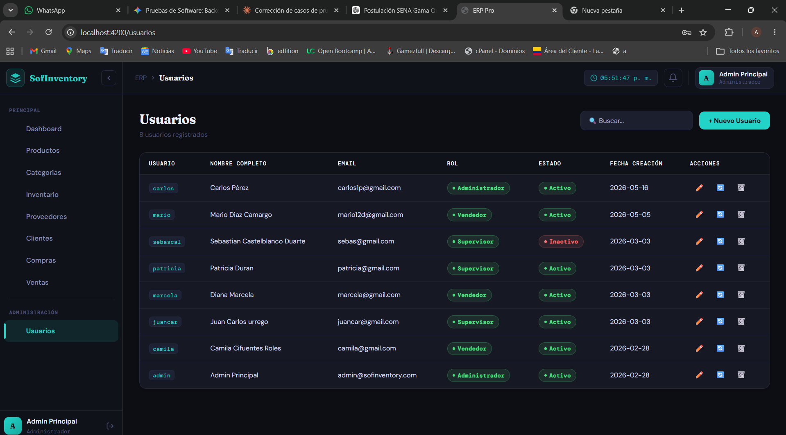](./evidencias/frontend/TC-USR-001-frontend.png) |
| Postman | [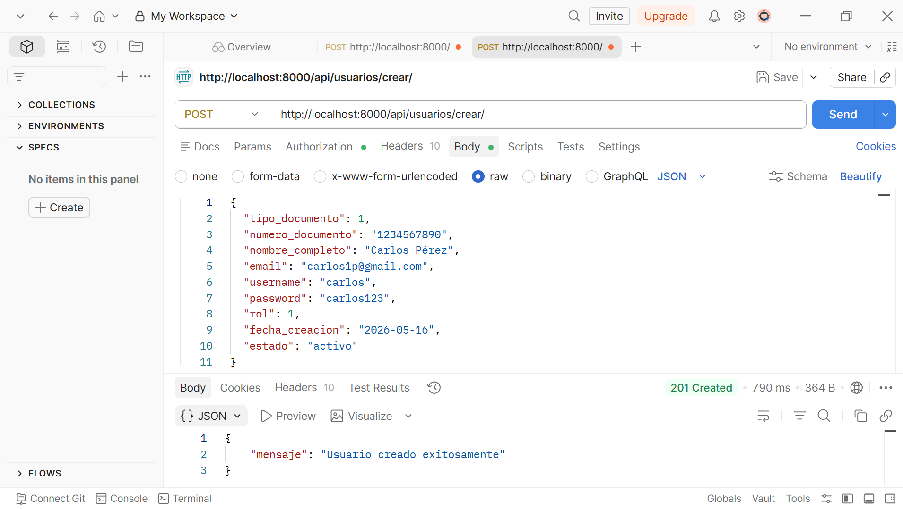](./evidencias/postman/TC-USR-001-postman.png) |
| Database | [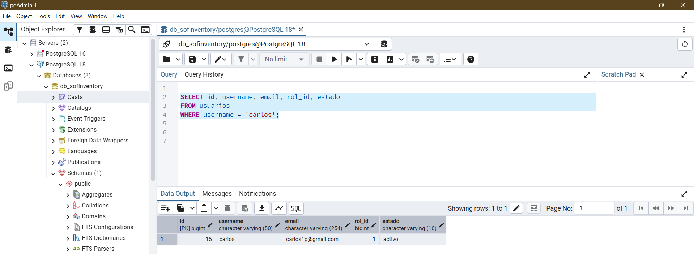](./evidencias/database/TC-USR-001-db.png) |

*📌 Clic en cualquier imagen para ver a pantalla completa*

**Resultado final:** ✅ Exitoso

**Observación:** El usuario fue creado correctamente y el registro persiste en PostgreSQL con todos los campos esperados.

---

### TC-USR-002: Creación exitosa de usuario supervisor

**Descripción**
Verificar que se puede crear un usuario con rol Supervisor y que sus permisos quedan correctamente restringidos en el sistema.

**📌 Información General**

| Campo | Detalle |
|---|---|
| Identificador | TC-USR-002 |
| Nombre | Creación exitosa de usuario supervisor |
| Tipo de prueba | Funcional / Control de acceso |
| Prioridad | Alta |
| Módulo | Gestión de Usuarios |
| Estado | ✅ Pasó |

**Precondiciones**
El tester está autenticado como administrador con un token Bearer válido.

**Datos de entrada**
```json
{
  "tipo_documento": 1,
  "numero_documento": "9876543210",
  "nombre_completo": "Laura Gómez",
  "email": "laura1g@gmail.com",
  "username": "lauraG",
  "password": "laura123",
  "rol": 2,
  "fecha_creacion": "2026-05-14",
  "estado": "activo"
}
```

**Pasos a seguir**
1. Iniciar sesión como administrador.
2. Navegar a Configuración > Usuarios > Nuevo Usuario.
3. Completar los datos con rol "Supervisor".
4. Guardar.
5. Cerrar sesión e iniciar sesión con `lauraG` / `laura123`.
6. Verificar que el módulo de administración de usuarios no es accesible.
7. En pgAdmin verificar:
   ```sql
   SELECT u.username, r.nombre AS rol, u.estado
   FROM usuarios u
   INNER JOIN roles r ON u.rol_id = r.id
   WHERE u.username = 'lauraG';
   ```

**Resultado esperado**
- HTTP 201. Usuario creado con rol Supervisor.
- Al iniciar sesión, la respuesta de `/api/auth/me/` refleja `"rol": "Supervisor"`.
- El menú de administración no es visible.

**Resultado obtenido**
El usuario fue creado exitosamente. Al autenticarse, el menú de administración no estaba visible y el campo `rol` confirmó el rol Supervisor.

**Evidencias**

| Tipo | Evidencia |
|---|---|
| Frontend | [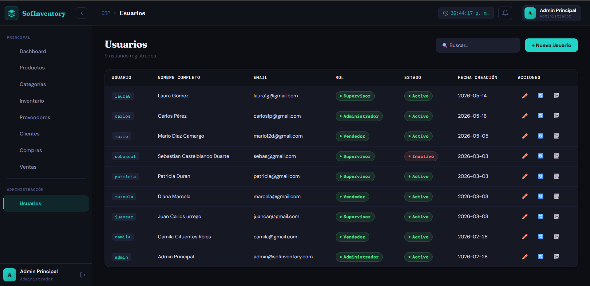](./evidencias/frontend/TC-USR-002-frontend.png) |
| Database | [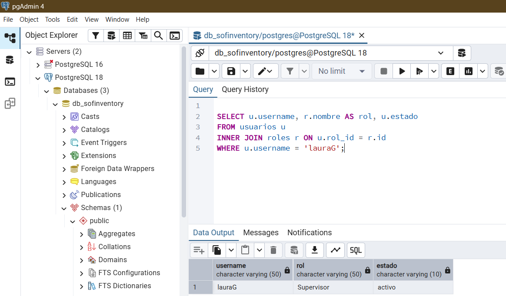](./evidencias/database/TC-USR-002-db.png) |

*📌 Clic en cualquier imagen para ver a pantalla completa*

**Resultado final:** ✅ Exitoso

**Observación:** El rol Supervisor fue asignado correctamente y las restricciones de acceso funcionan como se espera.

---

### TC-USR-003: Rechazo por username duplicado

**Descripción**
Verificar que el sistema no permite registrar dos usuarios con el mismo username, ya que el campo tiene restricción `UNIQUE` en la tabla `usuarios` de PostgreSQL.

**📌 Información General**

| Campo | Detalle |
|---|---|
| Identificador | TC-USR-003 |
| Nombre | Rechazo por username duplicado |
| Tipo de prueba | Validación / Integridad de datos |
| Prioridad | Alta |
| Módulo | Gestión de Usuarios |
| Estado | ✅ Pasó |

**Precondiciones**
Existe un usuario con `username = 'carlos'` (creado en TC-USR-001).

**Datos de entrada**
```json
{
  "username": "carlos",
  "email": "CarlosG@gmail.com"
}
```
*(demás campos con valores válidos)*

**Pasos a seguir**
1. Abrir formulario de Nuevo Usuario.
2. Ingresar el mismo username `carlos` ya registrado.
3. Clic en "Guardar".
4. Verificar la respuesta en Postman y el frontend.

**Resultado esperado**
- HTTP 400 Bad Request con mensaje indicando que el username ya está en uso.
- No se crea el registro duplicado en la tabla `usuarios`.

**Resultado obtenido**
El servidor Django respondió con HTTP 400 y el error `{"username": ["Ya existe usuario con este username."]}`. El frontend mostró el mensaje de validación.

**Evidencias**

| Tipo | Evidencia |
|---|---|
| Frontend | [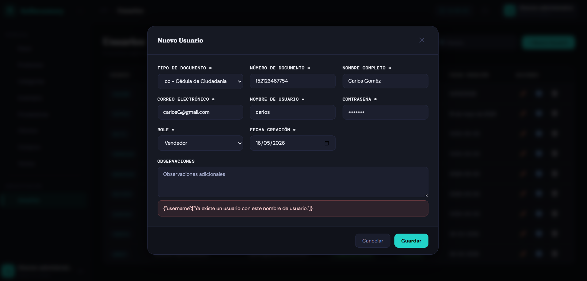](./evidencias/frontend/TC-USR-003-frontend.png) |
| Postman | [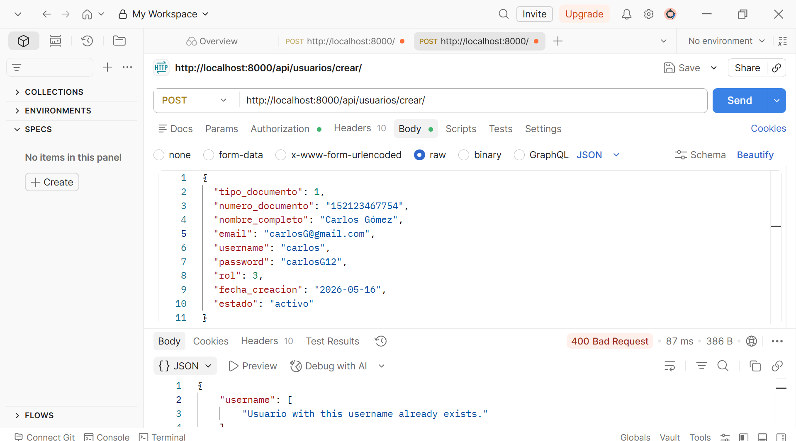](./evidencias/postman/TC-USR-003-postman.png) |

*📌 Clic en cualquier imagen para ver a pantalla completa*

**Resultado final:** ✅ Exitoso

**Observación:** La restricción UNIQUE del campo `username` en PostgreSQL y la validación de DRF funcionan correctamente.

---

### TC-USR-004: Rechazo por contraseña débil

**Descripción**
Verificar que el sistema rechaza contraseñas que no cumplen la política de seguridad (mínimo 8 caracteres, al menos una mayúscula, un número y un carácter especial).

**📌 Información General**

| Campo | Detalle |
|---|---|
| Identificador | TC-USR-004 |
| Nombre | Rechazo por contraseña débil |
| Tipo de prueba | Validación / Seguridad |
| Prioridad | Alta |
| Módulo | Gestión de Usuarios |
| Estado | ❌ Falló |

**Precondiciones**
El tester está autenticado como administrador.

**Datos de entrada**
```json
{ "username": "test.seguridad", "password": "123" }
```
*(demás campos con valores válidos)*

**Pasos a seguir**
1. Abrir formulario de Nuevo Usuario.
2. Ingresar contraseñas débiles (`123`, `12345`, contraseña sin mayúsculas ni caracteres especiales).
3. Intentar guardar desde el formulario.
4. Desde Postman: enviar el mismo body para verificar la validación del backend.

**Resultado esperado**
- Frontend: indicador de contraseña débil visible, formulario bloqueado sin permitir el envío.
- Postman: HTTP 400 Bad Request con detalle del error de validación de contraseña.
- En ningún caso el usuario debe quedar registrado en la base de datos.

**Resultado obtenido**
El sistema permitió crear el usuario con contraseñas débiles (`123`, `12345`) tanto desde el formulario Angular como desde Postman. No hubo ninguna validación en el backend — el `UsuarioSerializer` no aplica políticas de contraseña. El frontend tampoco bloqueó el envío.

**Severidad:** 🔴 Alta — Usuarios con contraseñas débiles representan un riesgo de seguridad directo en producción.
**Defecto registrado:** BUG-USR-002

**Evidencias**

| Tipo | Evidencia |
|---|---|
| Frontend | [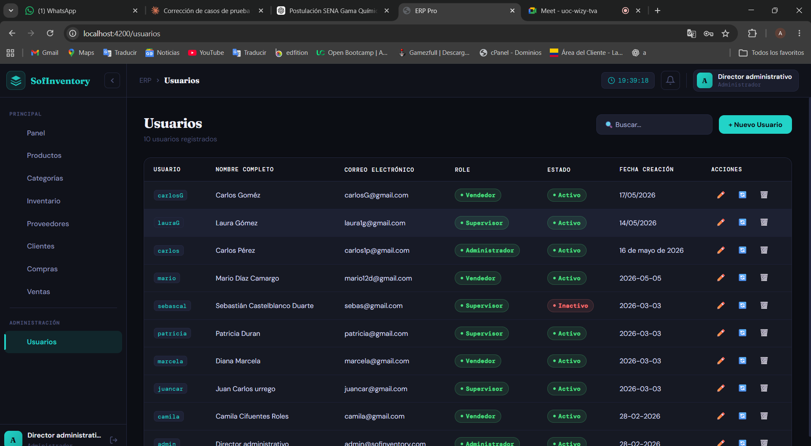](./evidencias/frontend/TC-USR-004-frontend.png) |
| Postman | [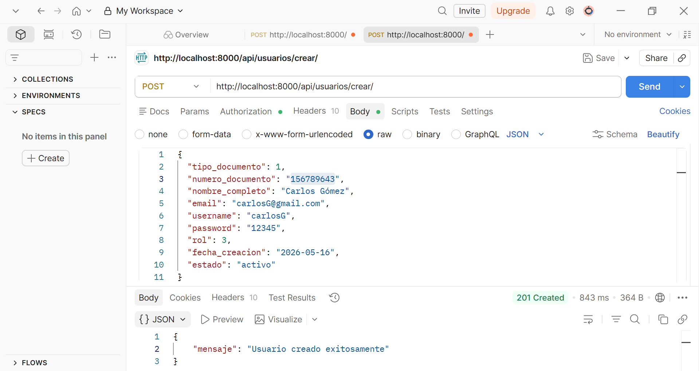](./evidencias/postman/TC-USR-004-postman.png) |

*📌 Clic en cualquier imagen para ver a pantalla completa*

**Resultado final:** ❌ Fallido

**Observación:** La política de contraseñas no está implementada ni en el frontend ni en el backend. Se debe agregar validación en el `UsuarioSerializer` con los validadores de contraseña de Django (`AUTH_PASSWORD_VALIDATORS`) y en el formulario Angular con `Validators.pattern`. Ver BUG-USR-002 en DEFECTOS.md.

---

### TC-USR-005: Rechazo por número de documento con formato inválido

**Descripción**
Verificar que el sistema rechaza la creación de un usuario cuando el campo `numero_documento` contiene caracteres no numéricos.

**📌 Información General**

| Campo | Detalle |
|---|---|
| Identificador | TC-USR-005 |
| Nombre | Documento con formato inválido |
| Tipo de prueba | Validación / Integridad de datos |
| Prioridad | Alta |
| Módulo | Gestión de Usuarios |
| Estado | ❌ Falló |

**Precondiciones**
El tester está autenticado como administrador.

**Datos de entrada**
```json
{ "numero_documento": "ABCDE!!!" }
```
*(demás campos con valores válidos)*

**Pasos a seguir**
1. Abrir formulario de Nuevo Usuario.
2. Ingresar `ABCDE!!!` en el campo número de documento.
3. Completar el resto de campos con datos válidos.
4. Clic en "Guardar".
5. Verificar en pgAdmin:
   ```sql
   SELECT numero_documento FROM usuarios
   ORDER BY id DESC LIMIT 1;
   ```

**Resultado esperado**
- HTTP 400 Bad Request.
- Mensaje: `"El número de documento solo debe contener dígitos"`.
- El registro no se crea en la base de datos.

**Resultado obtenido**
⚠️ El sistema creó el registro con el valor `ABCDE!!!` en la columna `numero_documento` sin mostrar ningún error. No existe validación de formato en el `UsuarioSerializer` ni en el formulario Angular.

**Severidad:** 🔴 Alta — Compromete la integridad de los datos en PostgreSQL.
**Defecto registrado:** BUG-USR-001

**Evidencias**

| Tipo | Evidencia |
|---|---|
| Postman | [](./evidencias/postman/TC-USR-005-postman.png) |
| Database | [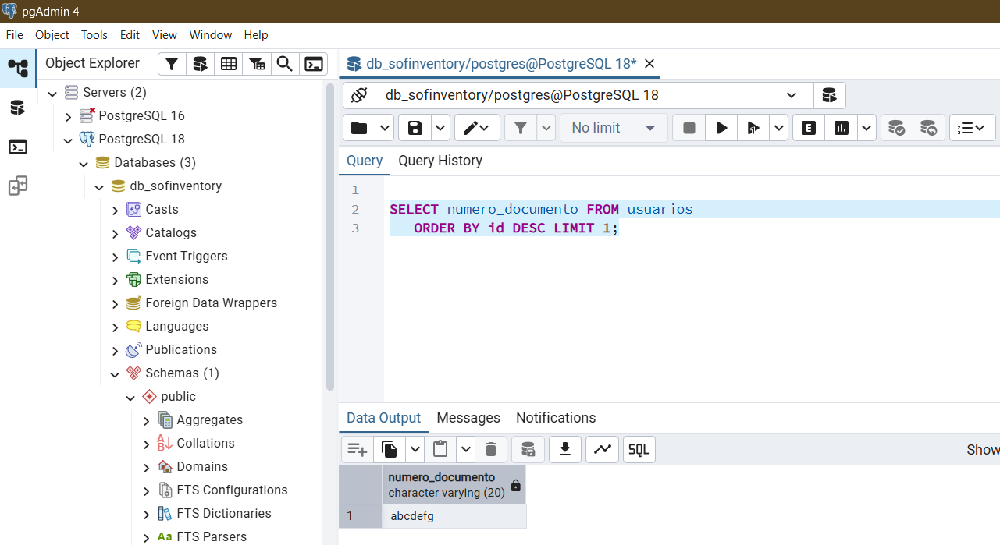](./evidencias/database/TC-USR-005-db.png) |

*📌 Clic en cualquier imagen para ver a pantalla completa*

**Resultado final:** ❌ Fallido

**Observación:** Se debe agregar un `RegexValidator` en el `UsuarioSerializer` y validación equivalente en Angular. Ver BUG-USR-001 en DEFECTOS.md.

---

### TC-USR-006: Rechazo por campos obligatorios vacíos

**Descripción**
Verificar que el sistema no permite crear un usuario si se omiten los campos obligatorios del formulario.

**📌 Información General**

| Campo | Detalle |
|---|---|
| Identificador | TC-USR-006 |
| Nombre | Rechazo por campos obligatorios vacíos |
| Tipo de prueba | Validación / Funcional |
| Prioridad | Media |
| Módulo | Gestión de Usuarios |
| Estado | ✅ Pasó |

**Precondiciones**
El tester está autenticado como administrador.

**Datos de entrada**
- Frontend: formulario completamente en blanco.
- Postman: body `{}`

**Pasos a seguir**
1. Abrir formulario de Nuevo Usuario.
2. No llenar ningún campo.
3. Clic en "Guardar".
4. Desde Postman: `POST /api/usuarios/crear/` con body `{}` y token de administrador.

**Resultado esperado**
- Frontend: mensajes de validación visibles en todos los campos requeridos (`username`, `password`, `email`, `nombre_completo`, `tipo_documento`, `numero_documento`, `rol`, `fecha_creacion`).
- Postman: HTTP 400 con lista de errores por campo faltante (DRF los enumera automáticamente).

**Resultado obtenido**
Los mensajes de validación aparecieron en el frontend para todos los campos requeridos. Postman respondió HTTP 400 con el detalle de cada campo obligatorio faltante.

**Evidencias**

| Tipo | Evidencia |
|---|---|
| Frontend | [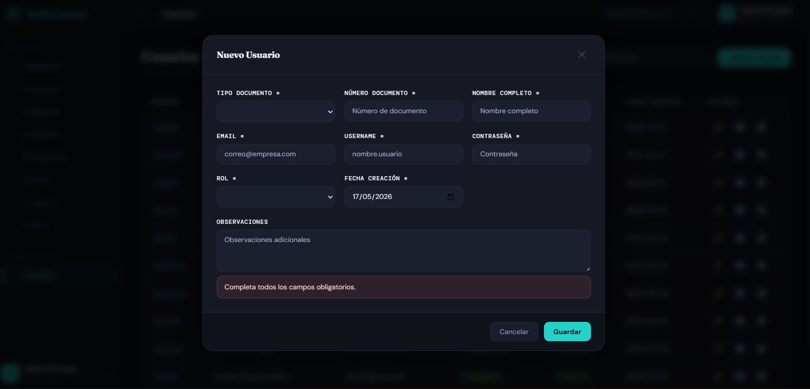](./evidencias/frontend/TC-USR-006-frontend.png) |
| Postman | [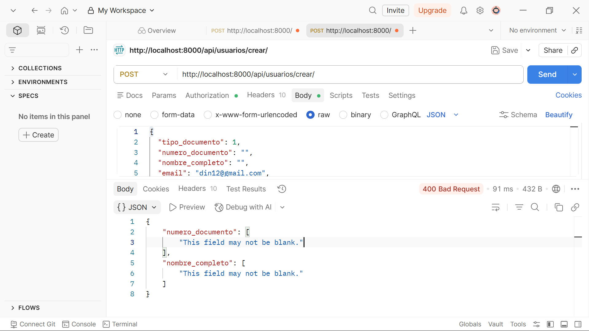](./evidencias/postman/TC-USR-006-postman.png) |

*📌 Clic en cualquier imagen para ver a pantalla completa*

**Resultado final:** ✅ Exitoso

**Observación:** Las validaciones de campos obligatorios funcionan correctamente tanto en el frontend Angular como en el `UsuarioSerializer` de DRF.

---

### TC-USR-007: Verificación de contraseña hasheada en base de datos

**Descripción**
Verificar que la contraseña del usuario es almacenada en PostgreSQL utilizando el algoritmo PBKDF2-SHA256 de Django y nunca en texto plano.

**📌 Información General**

| Campo | Detalle |
|---|---|
| Identificador | TC-USR-007 |
| Nombre | Contraseña hasheada en base de datos |
| Tipo de prueba | Seguridad / Integridad de datos |
| Prioridad | Alta |
| Módulo | Gestión de Usuarios |
| Estado | ✅ Pasó |

**Precondiciones**
El usuario `carlos` fue creado en TC-USR-001 con contraseña `carlos123`.
Acceso a pgAdmin 4 con conexión a la base de datos de SofInventory.

**Datos de entrada**
```sql
SELECT username, password
FROM usuarios
WHERE username = 'carlos';
```

**Pasos a seguir**
1. Abrir pgAdmin 4 y conectarse a la base de datos de SofInventory.
2. Abrir el Query Tool.
3. Ejecutar la consulta SQL indicada.
4. Observar el valor de la columna `password`.

**Resultado esperado**
- El campo `password` muestra un hash con el formato Django: `pbkdf2_sha256$<iteraciones>$<salt>$<hash_base64>`.
- La cadena `carlos123` **no debe aparecer** en ninguna columna.

**Resultado obtenido**
El campo `password` contenía el hash completo en formato PBKDF2-SHA256. La contraseña en texto plano no era visible en ninguna columna.

**Evidencias**

| Tipo | Evidencia |
|---|---|
| Database | [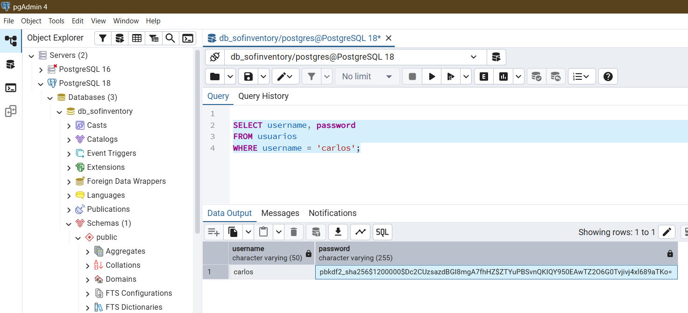](./evidencias/database/TC-USR-007-db.png) |

*📌 Clic en cualquier imagen para ver a pantalla completa*

**Resultado final:** ✅ Exitoso

**Observación:** Django aplica automáticamente PBKDF2-SHA256 al campo password. Ningún dato sensible queda expuesto en la base de datos.

---

### TC-USR-008: Usuario creado puede iniciar sesión

**Descripción**
Verificar que un usuario recién creado puede autenticarse exitosamente en el módulo de Login usando su username y contraseña. (Caso de integración: Usuarios → Login)

**📌 Información General**

| Campo | Detalle |
|---|---|
| Identificador | TC-USR-008 |
| Nombre | Usuario creado puede iniciar sesión |
| Tipo de prueba | Integración |
| Prioridad | Alta |
| Módulo | Usuarios → Login |
| Estado | ✅ Pasó |

**Precondiciones**
Usuario `lauraG` fue creado en TC-USR-002 con contraseña `laura123` y estado activo.

**Datos de entrada**
```json
{ "username": "lauraG", "password": "laura123" }
```

**Pasos a seguir**
1. Cerrar toda sesión activa.
2. En Postman: `POST /api/auth/login/` con el body indicado.
3. Verificar que la respuesta incluye `access_token`, `expires_at` y el objeto `usuario`.
4. En el frontend, navegar a la pantalla de Login e ingresar las credenciales.
5. Verificar redirección al dashboard con el menú de supervisor.

**Resultado esperado**
- HTTP 200.
- Respuesta contiene `access_token`, `expires_at` y `"rol": "Supervisor"`.
- El frontend redirige correctamente al dashboard.
- La sesión queda registrada en `sesiones_api` con `activa = true`.

**Resultado obtenido**
El usuario accedió correctamente. Se generó un token Bearer válido almacenado en la tabla `sesiones_api`. La redirección al dashboard fue exitosa con el menú de supervisor.

**Evidencias**

| Tipo | Evidencia |
|---|---|
| Frontend | [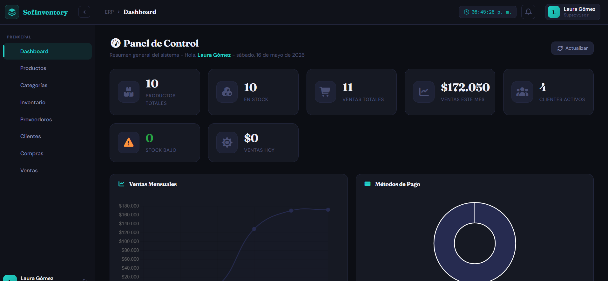](./evidencias/frontend/TC-USR-008-frontend.png) |
| Postman | [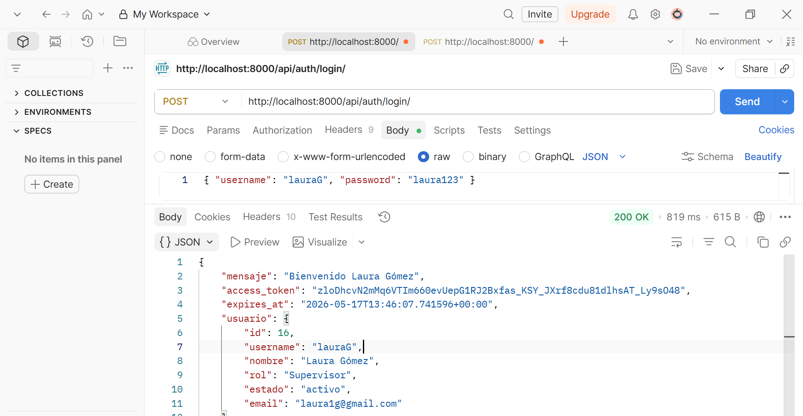](./evidencias/postman/TC-USR-008-postman.png) |

*📌 Clic en cualquier imagen para ver a pantalla completa*

**Resultado final:** ✅ Exitoso

**Observación:** La integración entre el módulo de Usuarios y el módulo de Login funciona correctamente. El usuario creado puede autenticarse de inmediato.

---

## 📊 Resumen de Resultados

| ID | Descripción | Severidad (si falló) | Estado |
|----|-------------|---------------------|--------|
| TC-USR-001 | Crear usuario administrador | — | ✅ Pasó |
| TC-USR-002 | Crear usuario supervisor | — | ✅ Pasó |
| TC-USR-003 | Username duplicado rechazado | — | ✅ Pasó |
| TC-USR-004 | Contraseña débil rechazada | 🔴 Alta| ❌ Falló|
| TC-USR-005 | Número de documento inválido | 🔴 Alta | ❌ Falló |
| TC-USR-006 | Campos obligatorios vacíos rechazados | — | ✅ Pasó |
| TC-USR-007 | Contraseña almacenada como hash PBKDF2 | — | ✅ Pasó |
| TC-USR-008 | Usuario creado puede hacer login | — | ✅ Pasó |
| **TOTAL** | | | **6/8 (75.0%)** |

---

## 🔍 Análisis de Resultados

| Aspecto | Resultado | Evaluación |
|---------|-----------|-----------|
| Validaciones de formulario (frontend) | Campos requeridos validados; política de contraseña ausente | ❌ Deficiencia |
| Unicidad de username en PostgreSQL | Restricción UNIQUE aplicada correctamente | ✅ Correcto |
| Persistencia de datos en BD | Datos guardados correctamente en tabla `usuarios` | ✅ Correcto |
| Seguridad de contraseñas (hashing) | PBKDF2-SHA256 aplicado en todos los casos | ✅ Correcto |
| Política de contraseñas (frontend y backend) | Sin validación — contraseñas débiles como `123` aceptadas | ❌ Deficiencia crítica |
| Validación de número de documento | Sin validación de formato — datos inválidos aceptados | ❌ Deficiencia crítica |
| Roles y permisos | Restricciones de acceso por rol funcionan correctamente | ✅ Correcto |
| Integración con Login | Usuario creado accede correctamente con su username | ✅ Correcto |

**Hallazgos principales:**
- **BUG-USR-001:** Ausencia de validación de formato en `numero_documento` — permite ingreso de caracteres inválidos en PostgreSQL, comprometiendo la integridad de los datos y los reportes que dependan de ese campo.
- **BUG-USR-002:** Ausencia de política de contraseñas en frontend y backend — el sistema acepta contraseñas débiles como `123`, exponiendo las cuentas a ataques de fuerza bruta.

---

## 💡 Recomendaciones

| # | Prioridad | Categoría | Recomendación |
|---|-----------|-----------|---------------|
| 1 | 🔴 Crítico | Seguridad | Agregar un `RegexValidator` en el campo `numero_documento` del `UsuarioSerializer` para aceptar solo dígitos (`^\d+$`). Complementar con validación equivalente en el formulario Angular. |
| 2 | 🔴 Crítico | Seguridad | Activar `AUTH_PASSWORD_VALIDATORS` en `settings.py` de Django y conectarlos al `UsuarioSerializer`. Agregar `Validators.pattern` en Angular para exigir mínimo 8 caracteres, una mayúscula, un número y un carácter especial. |
| 3 | 🟠 Importante | Validación | Agregar restricción de longitud mínima y máxima al campo `numero_documento` según el tipo de documento (ej. CC: 7-10 dígitos). |
| 4 | 🟡 Mejora | Auditoría | Registrar la creación de usuarios incluyendo el administrador que realizó la acción, IP de origen y fecha/hora. |
| 5 | 🔵 Buenas prácticas | UX | Implementar confirmación de contraseña en el formulario Angular para evitar errores tipográficos al crear el usuario. |

---

*© 2026 SofInventory — Área de Calidad de Software | Versión 1.0.0*
