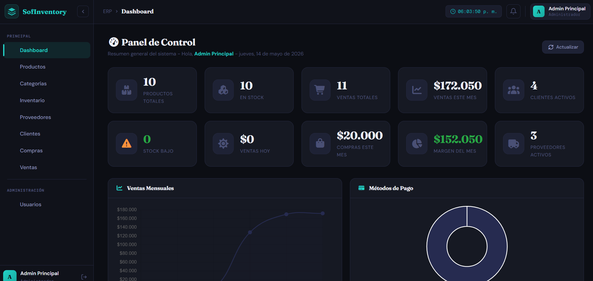
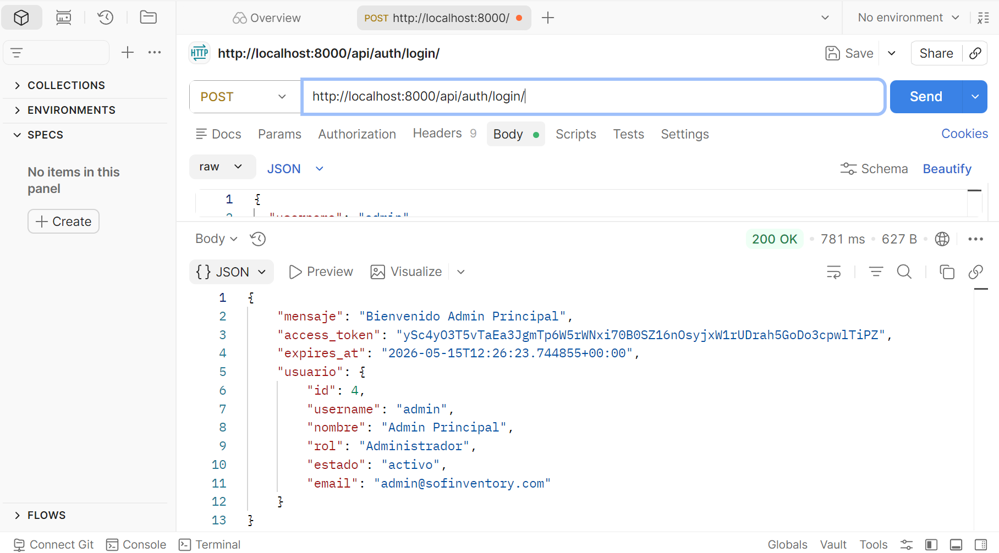
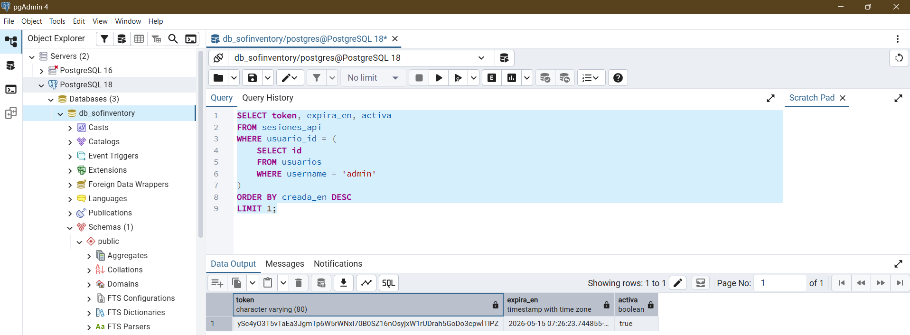

# 🧪 Casos de Prueba — Módulo Login

> **Versión:** 1.0.0
> **Módulo:** Login / Autenticación
> **Prefijo de código:** TC-LOGIN
> **Total de casos:** 10
> **Fecha:** 15 de mayo de 2026
> **Autor:** Alejandro Sepúlveda Duarte

---

## 📋 Plantilla de Caso de Prueba

Cada caso de prueba sigue esta estructura estándar:

| Campo | Descripción  |
|---|---|
| Identificador | Código único del caso (TC-LOGIN-XXX) |
| Descripción | Qué se está probando |
| Precondiciones | Estado previo requerido del sistema |
| Datos de entrada | Valores utilizados en la prueba |
| Pasos a seguir | Secuencia de acciones a ejecutar |
| Resultado esperado | Comportamiento correcto del sistema |
| Resultado obtenido | Comportamiento real observado |
| Estado | ✅ Pasó / ❌ Falló / ⚠️ Bloqueado |
| Evidencias | Referencias a capturas de pantalla o archivos |

---

## 📝 Descripción de la Funcionalidad

El módulo de Login de SofInventory implementa autenticación basada en **username y contraseña**. Al autenticarse exitosamente, el servidor Django genera un **token Bearer** único (64 caracteres URL-safe) que se persiste en la tabla `sesiones_api` de PostgreSQL con una duración de 12 horas. Este token debe incluirse en el header `Authorization: Bearer <token>` de todas las peticiones subsiguientes a recursos protegidos.

El sistema invalida todas las sesiones activas previas del usuario al hacer login (una sola sesión activa por usuario). Al hacer logout, el campo `activa` de la sesión en la tabla `sesiones_api` se establece en `false`.

**Endpoints involucrados:**
- `POST /api/auth/login/` — Autenticación y obtención del token Bearer
- `POST /api/auth/logout/` — Cierre de sesión / invalidación del token
- `GET /api/auth/me/` — Verificación del token activo y datos del usuario

---

##  🧪 Casos de Prueba

---

### TC-LOGIN-001: Login exitoso como administrador

**Descripción**
Verificar que un usuario con rol Administrador puede autenticarse correctamente usando su username y contraseña, y acceder al dashboard con todos los permisos habilitados.

**📌 Información General**

| Campo | Detalle |
|---|---|
| Identificador | TC-LOGIN-001 |
| Nombre | Login exitoso como administrador |
| Tipo de prueba | Funcional |
| Prioridad | Alta |
| Módulo | Autenticación |
| Estado | ✅ Pasó |

**Precondiciones**
Existe usuario con `username = 'admin'`, contraseña `Admin123`, rol Administrador y estado activo en la tabla `usuarios`.
El servidor Django y la base de datos PostgreSQL están en línea.

**Datos de entrada**
```json
{ "username": "admin", "password": "Admin123" }
```

**Pasos a seguir**
1. Navegar a la URL del sistema (`http://localhost:4200`).
2. Ingresar el username y contraseña del administrador.
3. Clic en "Iniciar Sesión".
4. Verificar redirección al dashboard.
5. En Postman: `POST /api/auth/login/` con el body indicado:
   ```json
   { "username": "admin", "password": "Admin123" }
   ```
6. En pgAdmin ejecutar:
   ```sql
   SELECT token, expira_en, activa
   FROM sesiones_api
   WHERE usuario_id = (SELECT id FROM usuarios WHERE username = 'admin')
   ORDER BY creada_en DESC LIMIT 1;
   ```

**Resultado esperado**
- El sistema debe retornar código HTTP 200 OK.
- Debe generarse un token Bearer válido registrado en `sesiones_api`.
- El usuario debe ser redirigido al dashboard.
- El campo `activa` debe quedar en `true` en PostgreSQL.
- El menú administrativo debe visualizarse correctamente.

**Resultado obtenido**
El sistema redirigió correctamente al dashboard. El token Bearer fue generado y registrado en la tabla `sesiones_api`. El menú de administración fue visible.

**Evidencias**

| Tipo | Evidencia |
|---|---|

| Frontend | [](./evidencias/frontend/TC-LOGIN-001-frontend.png) |
| Postman  | [](./evidencias/postman/TC-LOGIN-001-postman.png) |
| Database | [](./evidencias/database/TC-LOGIN-001-db.png) |

*📌 Clic en cualquier imagen para ver a pantalla completa*

**Resultado final:** ✅ Exitoso

**Observación:** El flujo de autenticación funcionó correctamente en frontend, backend y base de datos.

---

### TC-LOGIN-002: Autenticación exitosa de usuario Supervisor

**Descripción**
Verificar que un usuario con rol Supervisor puede autenticarse y acceder al sistema con las restricciones de permisos correspondientes.

**📌 Información General**

| Campo | Detalle |
|---|---|
| Identificador | TC-LOGIN-002 |
| Nombre | Autenticación exitosa de usuario Supervisor |
| Tipo de prueba | Funcional |
| Prioridad | Alta |
| Módulo | Autenticación / Control de acceso |
| Estado | ✅ Pasó |

**Precondiciones**
Existe usuario con `username = 'sebascal'`, contraseña `sebas123`, rol Supervisor y estado activo en la tabla `usuarios`.

**Datos de entrada**
```json
{ "username": "sebascal", "password": "sebas123" }
```

**Pasos a seguir**
1. Ingresar las credenciales del Supervisor en el formulario de login.
2. Clic en "Iniciar Sesión".
3. Verificar redirección al dashboard.
4. Verificar que el menú NO muestra opciones de administración de usuarios.
5. En Postman: verificar que `GET /api/usuarios/listar/` con el token del Supervisor devuelve HTTP 403.

**Resultado esperado**
- HTTP 200. Acceso exitoso.
- Objeto `usuario` retornado con `"rol": "Supervisor"`.
- La sección Configuración > Usuarios no debe estar disponible en el menú.
- El endpoint `GET /api/usuarios/listar/` retorna HTTP 403 Forbidden con el token del Supervisor.

**Resultado obtenido**
Acceso exitoso. El menú de administración no fue visible para el Supervisor. La petición a `/api/usuarios/listar/` con el token de Supervisor retornó HTTP 403.

**Evidencias**

| Tipo | Evidencia |
|---|---|
| Frontend | [Ver captura](./evidencias/frontend/TC-LOGIN-002-frontend.png) |
| Postman | [Ver captura](./evidencias/postman/TC-LOGIN-002-postman.png) |

**Resultado final:** ✅ Exitoso

**Observación:** El control de acceso por rol funciona correctamente. El supervisor no puede acceder a endpoints de administración.

---

### TC-LOGIN-003: Rechazo de username no registrado

**Descripción**
Verificar que el sistema rechaza el intento de login con un username que no existe en la tabla `usuarios` de PostgreSQL.

**📌 Información General**

| Campo | Detalle |
|---|---|
| Identificador | TC-LOGIN-003 |
| Nombre | Rechazo de username no registrado |
| Tipo de prueba | Funcional / Seguridad |
| Prioridad | Alta |
| Módulo | Autenticación |
| Estado | ✅ Pasó |

**Precondiciones**
El username `usuario.fantasma` NO está registrado en la tabla `usuarios`.

**Datos de entrada**
```json
{ "username": "usuario.fantasma", "password": "CualquierPass@1" }
```

**Pasos a seguir**
1. Ingresar un username no registrado y cualquier contraseña en el formulario de login.
2. Clic en "Iniciar Sesión".
3. Observar el mensaje de respuesta en el frontend.
4. En Postman: verificar el código HTTP y el mensaje retornado.

**Resultado esperado**
- HTTP 401 Unauthorized.
- Mensaje genérico: `"Usuario o contrasena incorrectos"` (sin revelar que el username no existe, por seguridad).
- Sin acceso al sistema.
- No se crea ningún registro en `sesiones_api`.

**Resultado obtenido**
Se mostró el mensaje `"Usuario o contrasena incorrectos"`. El servidor respondió con código 401. No hubo acceso. No se generó ningún token.

**Evidencias**

| Tipo | Evidencia |
|---|---|
| Frontend | [Ver captura](./evidencias/frontend/TC-LOGIN-003-frontend.png) |
| Postman  | [Ver captura](./evidencias/postman/TC-LOGIN-003-postman.png) |

**Resultado final:** ✅ Exitoso

**Observación:** El sistema no revela si el username existe o no, lo cual es una buena práctica de seguridad.

---

### TC-LOGIN-004: Rechazo con campos vacíos

**Descripción**
Verificar que el sistema no permite enviar el formulario de login con los campos de username y/o contraseña vacíos.

**📌 Información General**

| Campo | Detalle |
|---|---|
| Identificador | TC-LOGIN-004 |
| Nombre | Rechazo con campos vacíos |
| Tipo de prueba | Validación / Funcional |
| Prioridad | Media |
| Módulo | Autenticación |
| Estado | ✅ Pasó |

**Precondiciones**
Ninguna sesión activa en el sistema.

**Datos de entrada**
- Frontend: formulario completamente en blanco.
- Postman: body `{}`

**Pasos a seguir**
1. Acceder al formulario de Login.
2. No ingresar ningún dato.
3. Clic en "Iniciar Sesión".
4. Desde Postman: `POST /api/auth/login/` con body `{}`.

**Resultado esperado**
- Frontend: campos marcados como inválidos con mensajes de validación visibles.
- Postman: HTTP 400 con mensaje `"error": "Datos invalidos"` (validación del `LoginSerializer` de DRF).
- No se realiza ninguna consulta a la tabla `usuarios`.

**Resultado obtenido**
Los mensajes de validación aparecieron en el frontend. Postman respondió HTTP 400 con `"error": "Datos invalidos"`. No se realizó ninguna consulta a la base de datos.

**Evidencias**

| Tipo | Evidencia |
|---|---|
| Frontend | [Ver captura](./evidencias/frontend/TC-LOGIN-004-frontend.png) |
| Postman | [Ver captura](./evidencias/postman/TC-LOGIN-004-postman.png) |

**Resultado final:** ✅ Exitoso

**Observación:** Las validaciones del formulario Angular y del `LoginSerializer` de DRF funcionan correctamente ante campos vacíos.

---

### TC-LOGIN-005: Rechazo de usuario inactivo

**Descripción**
Verificar que el sistema rechaza el intento de login de un usuario cuyo estado sea `inactivo` en la tabla `usuarios`, aunque sus credenciales sean correctas.

**📌 Información General**

| Campo | Detalle |
|---|---|
| Identificador | TC-LOGIN-005 |
| Nombre | Rechazo de usuario inactivo |
| Tipo de prueba | Funcional / Control de acceso |
| Prioridad | Alta |
| Módulo | Autenticación |
| Estado | ✅ Pasó |

**Precondiciones**
Existe usuario con `username = 'inactivo'`, contraseña `Inac@1234` y `estado = 'inactivo'` en la tabla `usuarios`.
Verificar estado previo en pgAdmin:
```sql
SELECT username, estado FROM usuarios WHERE username = 'inactivo';
```

**Datos de entrada**
```json
{ "username": "inactivo", "password": "Inac@1234" }
```

**Pasos a seguir**
1. Ingresar las credenciales del usuario inactivo en el formulario de login.
2. Clic en "Iniciar Sesión".
3. Observar el mensaje de respuesta.
4. Verificar en pgAdmin que no se generó ningún registro en `sesiones_api`:
   ```sql
   SELECT COUNT(*) FROM sesiones_api
   WHERE usuario_id = (SELECT id FROM usuarios WHERE username = 'inactivo')
   AND activa = true;
   ```

**Resultado esperado**
- HTTP 403 Forbidden.
- Mensaje: `"Usuario inactivo. Contacte al administrador."`.
- Sin acceso al sistema.
- No se genera token ni registro en `sesiones_api`.

**Resultado obtenido**
El sistema respondió con HTTP 403 y el mensaje `"Usuario inactivo. Contacte al administrador."`. El frontend mostró el mensaje de error. No se generó ningún registro en `sesiones_api`.

**Evidencias**

| Tipo | Evidencia |
|----|---|
| Frontend | [Ver captura](./evidencias/frontend/TC-LOGIN-005-frontend.png) |
| Postman | [Ver captura](./evidencias/postman/TC-LOGIN-005-postman.png) |

**Resultado final:** ✅ Exitoso
**Observación:** El sistema bloquea correctamente el acceso a usuarios inactivos antes de verificar la contraseña.

---

### TC-LOGIN-006: Contraseña incorrecta (usuario existe y está activo)

**Descripción**
Verificar que el sistema rechaza el acceso cuando el username es correcto pero la contraseña es incorrecta, sin revelar información sensible sobre la existencia del usuario.

**📌 Información General**

| Campo | Detalle |
|----|---|
| Identificador | TC-LOGIN-006 |
| Nombre | Contraseña incorrecta |
| Tipo de prueba | Funcional / Seguridad |
| Prioridad | Alta |
| Módulo | Autenticación |
| Estado | ✅ Pasó |

**Precondiciones**
Existe usuario activo con `username = 'admin'` en la tabla `usuarios`.

**Datos de entrada**
```json
{ "username": "admin", "password": "ContraseñaWrong99!" }
```

**Pasos a seguir**
1. Ingresar el username correcto del administrador con una contraseña incorrecta.
2. Clic en "Iniciar Sesión".
3. Comparar el mensaje de error con el obtenido en TC-LOGIN-003 (username inexistente).

**Resultado esperado**
- HTTP 401 Unauthorized.
- Mensaje genérico idéntico al de username no registrado: `"Usuario o contrasena incorrectos"`.
- El mensaje no revela que el username sí existe.
- No se genera token.

**Resultado obtenido**
Se mostró el mensaje `"Usuario o contrasena incorrectos"`. El mensaje fue idéntico al caso de username inexistente. No se generó token.

**Evidencias**

| Tipo | Evidencia |
|---|---|
| Frontend | [Ver captura](./evidencias/frontend/TC-LOGIN-006-frontend.png) |
| Postman  | [Ver captura](./evidencias/postman/TC-LOGIN-006-postman.png) |

**Resultado final:** ✅ Exitoso

**Observación:** El mensaje unificado para credenciales inválidas es una buena práctica de seguridad que previene la enumeración de usuarios.

---

### TC-LOGIN-007: Inyección de caracteres especiales

**Descripción**
Verificar que el sistema maneja correctamente la inyección de caracteres especiales en los campos de login, sin producir errores de servidor.

**📌 Información General**

| Campo | Detalle |
|----|---|
| Identificador | TC-LOGIN-007 |
| Nombre | Inyección de caracteres especiales |
| Tipo de prueba | Seguridad |
| Prioridad | Alta |
| Módulo | Autenticación |
| Estado | ❌ Falló |

**Precondiciones**
Ninguna sesión activa.

**Datos de entrada**
```json
{
  "username": "' OR '1'='1' --",
  "password": "<script>alert('xss')</script>"
}
```

**Pasos a seguir**
1. En Postman, enviar `POST /api/auth/login/` con el body indicado.
2. Observar el código de respuesta HTTP.
3. Verificar que no hubo acceso no autorizado.
4. Revisar los logs del servidor Django.

**Resultado esperado**
- HTTP 400 Bad Request.
- El `LoginSerializer` debe rechazar el input antes de procesar la consulta.
- No se accede al sistema ni se genera token.

**Resultado obtenido**
⚠️ **El servidor respondió con código HTTP 500 (Internal Server Error).** Aunque Django ORM usa consultas parametrizadas (previniendo SQL Injection real) y no se produjo acceso no autorizado, el error 500 indica que la excepción no fue manejada correctamente. El `LoginSerializer` no sanitizó ni rechazó los caracteres especiales.

**Severidad:** 🔴 Alta — El servidor no debe retornar 500 ante entradas inválidas; puede exponer información del stack en logs.
**Defecto registrado:** BUG-LOGIN-001

**Evidencias**

| Tipo | Evidencia |
|---|---|
| Postman | [Ver captura](./evidencias/postman/TC-LOGIN-007-postman.png) |
| Consola | [Ver captura](./evidencias/frontend/TC-LOGIN-007-console.png) |

**Resultado final:** ❌ Fallido

**Observación:** El backend responde 500 en lugar de 400. Se debe agregar validación de caracteres en el `LoginSerializer`. Ver BUG-LOGIN-001 en DEFECTOS.md.

---

### TC-LOGIN-008: Cierre de sesión correcto (Logout)

**Descripción**
Verificar que al cerrar sesión el token Bearer es invalidado en la tabla `sesiones_api` de PostgreSQL y el usuario no puede seguir accediendo a recursos protegidos con el token revocado.

**📌 Información General**

| Campo | Detalle |
|---|---|
| Identificador | TC-LOGIN-008 |
| Nombre | Cierre de sesión correcto (Logout) |
| Tipo de prueba | Funcional / Seguridad |
| Prioridad | Alta |
| Módulo | Autenticación |
| Estado | ✅ Pasó |

**Precondiciones**
El usuario `admin` está autenticado y tiene un token Bearer activo (`activa = true` en `sesiones_api`).

**Datos de entrada**
Token Bearer activo obtenido en TC-LOGIN-001.

**Pasos a seguir**
1. Desde el dashboard, clic en "Cerrar Sesión".
2. Verificar que redirige a la pantalla de Login.
3. En Postman: intentar `GET /api/auth/me/` con el token anterior.
4. En pgAdmin verificar:
   ```sql
   SELECT activa FROM sesiones_api
   WHERE token = '<token_usado>';
   ```

**Resultado esperado**
- Redirección al formulario de Login.
- Postman: HTTP 401 con mensaje `"Token invalido o sesion cerrada."`.
- En pgAdmin: el campo `activa` del registro de sesión debe ser `false`.
- El token ya no es funcional para ninguna petición protegida.

**Resultado obtenido**
La sesión se cerró correctamente. La petición con el token anterior retornó HTTP 401. En pgAdmin, el campo `activa` estaba en `false`.

**Evidencias**

| Tipo | Evidencia |
|---|---|
| Frontend | [Ver captura](./evidencias/frontend/TC-LOGIN-008-frontend.png) |
| Postman | [Ver captura](./evidencias/postman/TC-LOGIN-008-postman.png) |
| Database | [Ver captura](./evidencias/database/TC-LOGIN-008-db.png) |

**Resultado final:** ✅ Exitoso

**Observación:** El token es invalidado correctamente en `sesiones_api`. La invalidación ocurre en la base de datos, no depende del cliente.

---

### TC-LOGIN-009: Acceso a ruta protegida sin token

**Descripción**
Verificar que las rutas protegidas del sistema no son accesibles sin un token Bearer válido, tanto desde el frontend Angular (Guard) como desde el backend Django (DRF).

**📌 Información General**

| Campo | Detalle |
|---|---|
| Identificador | TC-LOGIN-009 |
| Nombre | Acceso a ruta protegida sin token |
| Tipo de prueba | Seguridad / Funcional |
| Prioridad | Alta |
| Módulo | Autenticación / Control de acceso |
| Estado | ✅ Pasó |

**Precondiciones**
No existe ninguna sesión activa. El servicio de autenticación de Angular no tiene token almacenado.

**Datos de entrada**
- URL directa: `http://localhost:4200/dashboard`
- Postman: `GET /api/auth/me/` sin header `Authorization`.

**Pasos a seguir**
1. Sin estar autenticado, intentar navegar directamente a `/dashboard`.
2. En Postman: `GET /api/auth/me/` sin incluir el header `Authorization`.
3. Observar ambas respuestas.

**Resultado esperado**
- Frontend: Angular Route Guard redirige automáticamente a la pantalla de Login.
- Backend: HTTP 401 Unauthorized desde DRF.

**Resultado obtenido**
El Angular Guard redirigió a Login. La API respondió con 401. El sistema no permitió ningún acceso sin token.

**Evidencias**

| Tipo | Evidencia |
|---|---|
| Frontend | [Ver captura](./evidencias/frontend/TC-LOGIN-009-frontend.png) |
| Postman | [Ver captura](./evidencias/postman/TC-LOGIN-009-postman.png) |

**Resultado final:** ✅ Exitoso

**Observación:** El Angular Route Guard y el middleware de autenticación de DRF protegen correctamente todos los recursos del sistema.

---

### TC-LOGIN-010: Comportamiento con sesión expirada

**Descripción**
Verificar que el sistema maneja correctamente una sesión cuyo token ha expirado en la tabla `sesiones_api`, solicitando al usuario que vuelva a iniciar sesión.

**📌 Información General**

| Campo | Detalle |
|---|---|
| Identificador | TC-LOGIN-010 |
| Nombre | Comportamiento con sesión expirada |
| Tipo de prueba | Funcional / Seguridad |
| Prioridad | Media |
| Módulo | Autenticación |
| Estado | ❌ Falló (parcialmente)|

**Precondiciones**
El usuario `admin` está autenticado y tiene una sesión activa en `sesiones_api`.
Acceso a pgAdmin para forzar la expiración.

**Datos de entrada**
Forzar expiración ejecutando en pgAdmin:
```sql
UPDATE sesiones_api
SET expira_en = NOW() - INTERVAL '1 hour'
WHERE activa = true
AND usuario_id = (SELECT id FROM usuarios WHERE username = 'admin');
```

**Pasos a seguir**
1. Autenticarse como administrador.
2. Ejecutar la consulta SQL en pgAdmin para adelantar la expiración de la sesión.
3. Sin cerrar el navegador, navegar a cualquier sección que cargue datos de la API (ej. `/dashboard`).
4. En Postman: `GET /api/auth/me/` con el token expirado.
5. Verificar en pgAdmin:
   ```sql
   SELECT activa FROM sesiones_api
   WHERE usuario_id = (SELECT id FROM usuarios WHERE username = 'admin')
   ORDER BY creada_en DESC LIMIT 1;
   ```

**Resultado esperado**
- Backend: HTTP 401 con mensaje `"La sesion expiro. Inicie sesion nuevamente."` y campo `activa` en `false`.
- Frontend: el `HttpInterceptor` de Angular captura el 401 y redirige a `/login` con el mensaje "Tu sesión ha expirado."

**Resultado obtenido**
✅ **Backend correcto:** Postman recibió HTTP 401 con el mensaje `"La sesion expiro. Inicie sesion nuevamente."` y en pgAdmin el campo `activa` pasó a `false`.
⚠️ **Frontend fallido:** el Angular frontend no interceptó el 401 devuelto por la API. El usuario permaneció en el dashboard viendo las secciones vacías sin ningún mensaje informativo ni redirección al Login.

**Severidad:** 🟡 Media — El backend maneja correctamente la expiración. El defecto es de UX en el frontend. No representa acceso no autorizado.
**Defecto registrado:** BUG-LOGIN-002

**Evidencias**

| Tipo | Evidencia |
|---|---|
| Postman | [Ver captura](./evidencias/postman/TC-LOGIN-010-postman.png) |
| Frontend | [Ver captura](./evidencias/frontend/TC-LOGIN-010-frontend.png) |
| Database | [Ver captura](./evidencias/database/TC-LOGIN-010-db.png) |

**Resultado final:** ❌ Fallido (parcialmente)
**Observación:** El backend invalida la sesión correctamente. El defecto está en el `HttpInterceptor` de Angular que no gestiona los 401 por sesión expirada. Ver BUG-LOGIN-002 en DEFECTOS.md.

---

## 📊 Resumen de Resultados

| ID | Descripción | Severidad (si falló) | Estado |
|----|-------------|---------------------|--------|
| TC-LOGIN-001 | Login exitoso — administrador | — | ✅ Pasó |
| TC-LOGIN-002 | Login exitoso — operador (permisos restringidos) | — | ✅ Pasó |
| TC-LOGIN-003 | Username no registrado rechazado | — | ✅ Pasó |
| TC-LOGIN-004 | Campos vacíos rechazados | — | ✅ Pasó |
| TC-LOGIN-005 | Usuario inactivo rechazado | — | ✅ Pasó |
| TC-LOGIN-006 | Contraseña incorrecta rechazada | — | ✅ Pasó |
| TC-LOGIN-007 | Inyección de caracteres especiales | 🔴 Alta | ❌ Falló |
| TC-LOGIN-008 | Cierre de sesión correcto | — | ✅ Pasó |
| TC-LOGIN-009 | Ruta protegida sin token rechazada | — | ✅ Pasó |
| TC-LOGIN-010 | Sesión expirada — frontend no redirige | 🟡 Media | ❌ Falló |
| **TOTAL** | | | **8/10 (80.0%)** |

---

## 🔍 Análisis de Resultados

| Aspecto Evaluado | Resultado | Estado |
|-----------------|-----------|--------|
| Autenticación con credenciales válidas | Funciona correctamente para todos los roles | ✅ Correcto |
| Rechazo de credenciales inválidas | Mensajes genéricos sin revelar información del usuario | ✅ Correcto |
| Bloqueo de usuario inactivo | HTTP 403 con mensaje claro | ✅ Correcto |
| Validaciones de formulario (frontend) | Campos requeridos validados correctamente | ✅ Correcto |
| Seguridad ante inyección de caracteres | Error 500 en backend — entrada no sanitizada en serializer | ❌ Deficiencia |
| Cierre de sesión e invalidación de token | Campo `activa = false` en `sesiones_api` — correcto | ✅ Correcto |
| Protección de rutas (Angular Guard) | Rutas sin token redirigen correctamente al Login | ✅ Correcto |
| Manejo de sesión expirada en backend | DRF invalida y retorna 401 correctamente | ✅ Correcto |
| Manejo de sesión expirada en frontend | Angular no intercepta el 401 ni redirige al Login | ❌ Deficiencia |
| Mensaje de error unificado (seguridad) | Sin distinción entre username inválido y contraseña incorrecta | ✅ Correcto (buena práctica) |

**Hallazgos:**
- **BUG-LOGIN-001:** El `LoginSerializer` no sanitiza caracteres especiales, causando un error 500 no controlado. Django ORM previene SQL Injection real, pero el 500 es inaceptable en producción.
- **BUG-LOGIN-002:** El frontend Angular carece de un `HttpInterceptor` que maneje los 401 por sesión expirada. El backend funciona correctamente; el problema es exclusivamente de UX en el cliente.

---

## 💡 Recomendaciones

1. **[CRÍTICO - Seguridad]** Agregar validación de caracteres permitidos en el `LoginSerializer` de DRF: `username = serializers.RegexField(regex=r'^[\w.@+-]+$')`. Esto garantiza que entradas malformadas retornen HTTP 400, no 500.

2. **[IMPORTANTE - UX]** Crear un `HttpInterceptor` en Angular que capture respuestas con código 401 y ejecute: limpiar el token del servicio de autenticación y redirigir a `/login` mostrando el mensaje "Tu sesión ha expirado. Por favor, inicia sesión nuevamente."

3. **[IMPORTANTE - Seguridad]** Implementar un mecanismo de **bloqueo temporal** después de N intentos fallidos de login (ej. bloqueo de 5 minutos tras 5 intentos fallidos) para prevenir ataques de fuerza bruta. Registrar los intentos en una tabla de auditoría en PostgreSQL.

4. **[MEJORA - Seguridad]** Registrar en logs todos los intentos de login fallidos, incluyendo username, IP de origen, `user_agent` y timestamp, para detección temprana de ataques.

5. **[MEJORA - UX]** Agregar un indicador visual del tiempo restante de sesión y una advertencia cuando queden menos de 30 minutos para que expire.

6. **[BUENAS PRÁCTICAS]** Implementar HTTPS en todos los ambientes (incluyendo desarrollo local) para proteger el token Bearer y las credenciales en tránsito.

---

*© 2026 SofInventory — Área de Calidad de Software | Versión 1.0.0*
